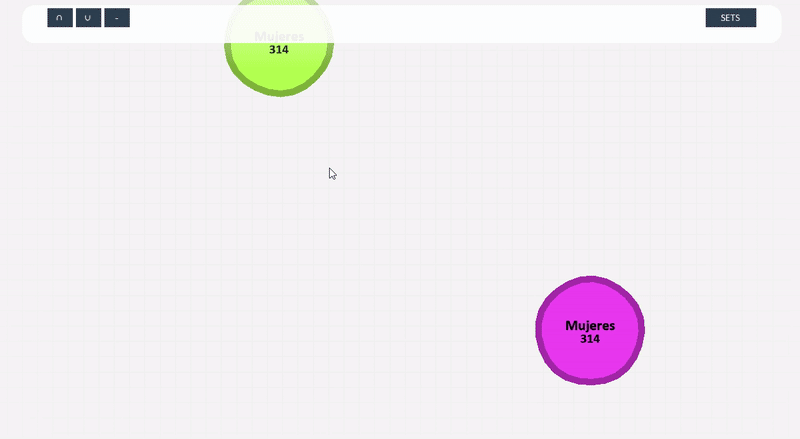
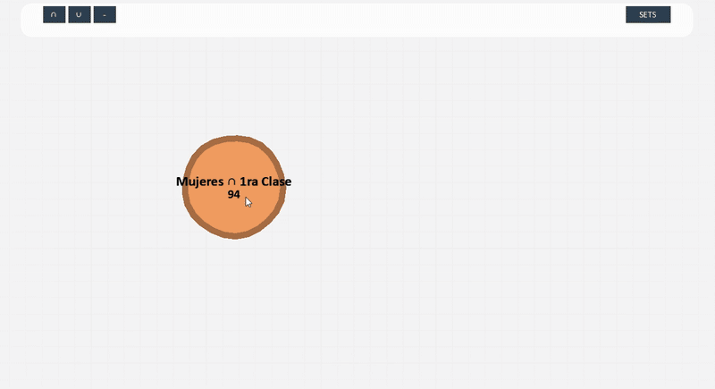

#  Pie-Playground: Laboratorio del Principio de Inclusión-Exclusión

<p align="center">
  
</p>

Una herramienta interactiva para visualizar y experimentar con la Teoría de Conjuntos y el **Principio de Inclusión-Exclusión (PIE)** utilizando datos reales del **Titanic**.

Este proyecto transforma conjuntos de datos abstractos en "células" con física propia, permitiendo fusionar, intersectar y diferenciar grupos para entender intuitivamente el concepto.

---

## ⬇ Descarga Rápida (Para Ejecución Inmediata)

Si desea probar la aplicación en Windows sin configurar Python ni instalar librerías, descarga el ejecutable portable aquí:

 **[Descargar Pie-Playground v1.0 (.exe)](https://github.com/Mudok1/pie-playground/releases/latest)**

*(Descomprimir y ejecutar. No requiere instalación).*

---

##  Explicación del Código y Fundamento Matemático

Este proyecto cumple con el requerimiento de **cálculo asociado al tema** mediante una implementación computacional de la Teoría de Conjuntos. A diferencia de una calculadora estática, el sistema resuelve el PIE dinámicamente.

### ¿Cómo funciona lo que programamos?

El núcleo lógico se encuentra en `src/base_sets/set_calculator.py` y `main.py`. El sistema no utiliza fórmulas rígidas, sino que **simula la lógica de conjuntos** utilizando estructuras de datos Hash (`sets` en Python).

1.  **Unicidad de Elementos:**
    Cada "Célula" contiene un conjunto de `PassengerId` únicos del dataset del Titanic.
    ```python
    # Ejemplo conceptual de lo que hace el código internamente
    conjunto_mujeres = {1, 2, 5, 8, ...}
    conjunto_1ra_clase = {1, 3, 5, 9, ...}
    ```

2.  **Cálculo de Operaciones (El motor del PIE):**
    Cuando el usuario fusiona dos células, el código ejecuta operaciones de conjuntos nativas, lo que garantiza el cálculo exacto de la cardinalidad:
    *   **Intersección ($\cap$):** `ids_resultado = set_a & set_b` (Solo elementos comunes).
    *   **Unión ($\cup$):** `ids_resultado = set_a | set_b` (Elementos en A o B, eliminando duplicados automáticamente).
    *   **Diferencia ($-$):** `ids_resultado = set_a - set_b` (Elementos en A que no están en B).

3.  **Demostración Visual del Principio:**
    Al realizar una **Unión**, el tamaño visual de la célula resultante y el gráfico de barras (Upset Plot) demuestran que:
    $$|A \cup B| \neq |A| + |B|$$
    Sino que el código aplica implícitamente:
    $$|A \cup B| = |A| + |B| - |A \cap B|$$

4.  **Recursividad:**
    El sistema permite operar sobre resultados previos (ej. `(Mujeres ∪ Niños) - Sobrevivientes`). El código maneja esto almacenando el "linaje" (`parents`) de cada célula, permitiendo reconstruir la fórmula matemática compleja que se muestra en el panel de inspección.

---

###  Física y Lógica de Conjuntos
Las células reaccionan a colisiones y lanzamientos. El sistema identifica y rechaza operaciones idempotentes ($A \cup A = A$), enseñando lógica matemática mediante feedback visual (rebote).

<p align="center">
  
</p>

---

### 🔬 Modo Inspección (Click Derecho)
Al inspeccionar una célula, se despliega un panel de análisis detallado:

*   **Upset Plot Dinámico:** Gráfico de barras que compara los conjuntos "Padres" con el "Resultado", evidenciando la pérdida o ganancia de elementos.
*   **Lista Real:** Muestra los nombres, edades y tarifas de los pasajeros reales que cumplen las condiciones.
*   **Fórmula Generativa:** Construye recursivamente la ecuación matemática de la operación realizada.

<p align="center">
  
</p>

## Instrucciones de Instalación 

Si prefieres ejecutar el código fuente o modificarlo:

**Requisitos:** Python 3.10 o superior.

1.  **Clonar el repositorio:**
    ```bash
    git clone https://github.com/Mudok1/pie-playground.git
    cd pie-playground
    ```

2.  **Crear entorno virtual (Opcional pero recomendado):**
    ```bash
    python -m venv .venv
    # Windows:
    .venv\Scripts\activate
    # Mac/Linux:
    source .venv/bin/activate
    ```

3.  **Instalar dependencias:**
    ```bash
    pip install -r requirements.txt
    ```

4.  **Ejecutar:**
    ```bash
    python main.py
    ```

## Controles

*   **Click Izquierdo:** Arrastrar y lanzar células.
*   **Click Derecho:** Inspeccionar célula (Ver detalles y gráficos).
*   **Rueda del Mouse:** Zoom In / Out.
*   **Click y Arrastre en Fondo:** Mover la cámara (Pan).
*   **Panel Izquierdo:** Seleccionar operación (`∩` Intersección o `-` Diferencia).
*   **Panel Derecho:** Añadir conjuntos base al tablero.

## Integrantes
* Diego Alexander Ibañez Torres
* Julian Andres Melo Bustos  
* Juan David Miguez Alba
* Francisco Arturo Miranda Cure
---
*Desarrollado para la clase de Matemáticas Discretas I.*